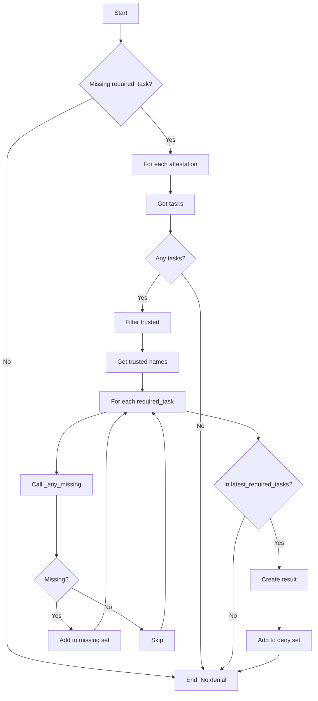

```mermaid
flowchart TD
    A[Start]
    B{Missing required_task?}
    Z[End: No denial]
    C{In latest_required_tasks?}
    D[Create result]
    E[Add to deny set]

    A --> B
    B -- No --> Z
    B -- Yes --> F

    F[For each attestation] --> G[Get tasks]
    G --> H{Any tasks?}
    H -- No --> Z
    H -- Yes --> I[Filter trusted]
    I --> J[Get trusted names]
    J --> K[For each required_task]
    K --> L[Call _any_missing]
    L --> M{Missing?}
    M -- Yes --> N[Add to missing set]
    M -- No --> O[Skip]
    N --> K
    O --> K
    K --> C

    C -- No --> Z
    C -- Yes --> D
    D --> E
    E --> Z
```
